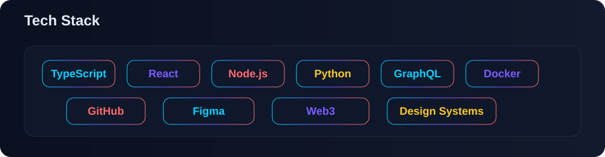

<!-- kalpick-sharma/README.md -->

<!-- ============================================ -->
<!-- PROFILE BANNER - SVG Animation                -->
<!-- ============================================ -->

  

<!-- ============================================ -->
<!-- TYPING EFFECT                                -->
<!-- ============================================ -->

  

<!-- ============================================ -->
<!-- SOCIAL BADGES - Auto-updated by workflow      -->
<!-- ============================================ -->

  <!-- Profile Views -->
  
  
  <!-- GitHub Stats -->
  
  
  
  <!-- Twitter/X -->
  

<!-- ============================================ -->
<!-- QUICK STATS - Animated SVG                    -->
<!-- ============================================ -->

  

<!-- ============================================ -->
<!-- ABOUT ME SECTION                             -->
<!-- ============================================ -->
## 🚀 About Me

Hey there! I'm **Kalpick Sharma**, a passionate **Community Architect** and **Design Engineer** who bridges the gap between creative design and technical implementation.

### 🎯 My Mission
Building thriving developer communities while crafting elegant digital experiences that make a difference.

### 🔥 What I Bring to the Table
- **270+** Community Members
- **100+** Brand Identities Designed
- **15+** Tech Events Hosted
- **10+** Strategic Partnerships
- **5,000+** Community Reach

### 💡 Quick Facts
- 🏗️ Building **AlloyTrik** - A cross-disciplinary community for Web3, AI, Design, and Development
- 🌐 Co-Founding **Delhi NCR DAO** - Scaling Web3 adoption in India
- 🎨 Designing **100+** brand identities as a freelancer
- 📝 Publishing technical content on **Dev.to**, **Medium**, and **Hashnode**

<!-- ============================================ -->
<!-- COMMUNITIES SECTION - Dynamic                 -->
<!-- ============================================ -->
## 🌟 Communities I'm Building

<!-- COMMUNITIES:START -->
| Community | Role | Members | Impact |
|-----------|------|---------|--------|
| AlloyTrik | Founder & Community Lead | 270+ | Integrating Web3, AI, Design, and Development |
| Delhi NCR DAO | Co-Founder & Community Manager | 400+ | 8 meetups, 300+ participants |
| Kalpikologoarts | Brand Identity Designer | 500+ | 100+ logos designed |
<!-- COMMUNITIES:END -->

<!-- ============================================ -->
<!-- EXPERIENCE SECTION - Dynamic                  -->
<!-- ============================================ -->
## 💼 Professional Journey

<!-- EXPERIENCE:START -->
### 🚀 **AlloyTrik** - Founder & Community Lead
*Aug 2025 - Present*
- Founded innovative community platform integrating Web3, AI, Design, and Development
- Built full-stack resources increasing community engagement by 40%
- Established cross-disciplinary collaboration with 10+ active projects

### 🌐 **Delhi NCR DAO** - Co-Founder & Community Manager
*Sep 2024 - Oct 2025*
- Scaled community from 0 to 400+ members through strategic growth
- Organized 8 developer meetups with 300+ total participants
- Built relationships with 10+ protocols and developer communities

### 🎨 **Freelance Brand Identity Designer**
*2020 - Present*
- Designed 100+ logos for startups, communities, and Web3 projects
- Built consistent visual identities showcased across Dribbble, Behance, Instagram
- Achieved 80% client retention rate
<!-- EXPERIENCE:END -->

<!-- ============================================ -->
<!-- TECH STACK VISUALIZATION - SVG                -->
<!-- ============================================ -->
## 🛠️ Tech Stack

<!-- Dynamic Tech Stack SVG -->

  

### 🎨 Design & Creative

### 💻 Frontend Development

### 🔧 Backend & Automation

### 🌐 Web3 & Community

### 🤖 AI & Automation

<!-- ============================================ -->
<!-- GITHUB STATS - Auto-updated by GitHub API     -->
<!-- ============================================ -->
## 📊 GitHub Analytics

  
  

<!-- ============================================ -->
<!-- CONTRIBUTION STREAK                          -->
<!-- ============================================ -->

  

<!-- ============================================ -->
<!-- CONTRIBUTION SNAKE - Auto-updated            -->
<!-- ============================================ -->
## 🐍 Contribution Snake

<picture>
  <source media="(prefers-color-scheme: dark)" srcset="https://raw.githubusercontent.com/KalpickSharma/KalpickSharma/output/github-contribution-grid-snake-dark.svg">
  <source media="(prefers-color-scheme: light)" srcset="https://raw.githubusercontent.com/KalpickSharma/KalpickSharma/output/github-contribution-grid-snake.svg">
  
</picture>

<!-- ============================================ -->
<!-- PROJECTS SECTION - Dynamic                    -->
<!-- ============================================ -->
## 📚 Featured Projects

<!-- PROJECTS:START -->
### 🏛️ **Gov-Assist: AI Bridge for User Support**
*Python, AI, Public Tech*
- Co-authored research paper presented at 2025 International Conference on Advanced Computing
- Implemented AI-driven bridge architecture for enhancing government user support systems

### 🤖 **Instabot: Workflow Automation**
*Python, Automation, Analytics*
- Engineered custom Python automation engine for workflow optimization
- Reduced manual tasks by 60%
- Implemented analytical insights dashboard for tracking community engagement metrics

### 🎨 **Immersive 3D Portfolio**
*React, Three.js, GSAP*
- Built performance-optimized immersive portfolio using Three.js, GSAP, and Anime.js
- Reverse engineered and optimized the project
<!-- PROJECTS:END -->

<!-- ============================================ -->
<!-- BLOG POSTS - Auto-updated from Dev.to/Medium  -->
<!-- ============================================ -->
## 📝 Latest Blog Posts

<!-- BLOG:START -->
- [DevRel in 2026: Your Developer Docs Have a New User](https://dev.to/kalpick_sharma_d32ace423a/devrel-in-2026-your-developer-docs-have-a-new-user-3b55)
- [Open Source AI Models Are Closing the Gap. Why That Matters for Developers](https://dev.to/kalpick_sharma_d32ace423a/open-source-ai-models-are-closing-the-gap-why-that-matters-for-developers-32ok)
- [I built a prototype of a PWA meeting app to better understand WebRTC.](https://www.linkedin.com/pulse/i-built-prototype-pwa-meeting-app-better-understand-webrtc-sharma-krvwc)
- [From Vibe Coding to Production: The New Role of the Design Engineer](https://www.linkedin.com/pulse/from-vibe-coding-production-new-role-design-engineer-kalpick-sharma-l0dsf)
<!-- BLOG:END -->

<!-- ============================================ -->
<!-- CERTIFICATIONS                               -->
<!-- ============================================ -->
## 🏅 Certifications

<!-- CERTIFICATIONS:START -->
- 🎓 **Software Design: From Requirements to Release** - LinkedIn (2025)
- 🐍 **Hands-On Introduction to Python** - LinkedIn (2024)
- 🤖 **Prompt Design in Vertex AI** - Google Cloud (2024)
<!-- CERTIFICATIONS:END -->

<!-- ============================================ -->
<!-- ACTIVITY METRICS - Dynamic                    -->
<!-- ============================================ -->
## 📈 Activity Metrics

  
| Metric | Value |
|--------|-------|
| 📝 Blog Articles Written | <!-- BLOGS:START -->15<!-- BLOGS:END --> |
| 🎤 Events Hosted | <!-- EVENTS:START -->10+<!-- EVENTS:END --> |
| 🤝 Community Members | <!-- MEMBERS:START -->270+<!-- MEMBERS:END --> |
| 🎨 Design Projects | <!-- DESIGNS:START -->100+<!-- DESIGNS:END --> |

<!-- ============================================ -->
<!-- CONNECT WITH ME                              -->
<!-- ============================================ -->
## 🌐 Connect With Me

  

)

<!-- ============================================ -->
<!-- FOOTER                                      -->
<!-- ============================================ -->
---

  <i>⚡ Building the future of communities, one line of code at a time.</i>
  
    
  
  
    📅 Last Updated: <!-- LAST_UPDATED:START -->2026-09-04 04:06:14 UTC<!-- LAST_UPDATED:END -->
     
    🚀 Made with ❤️ using GitHub Actions
  

